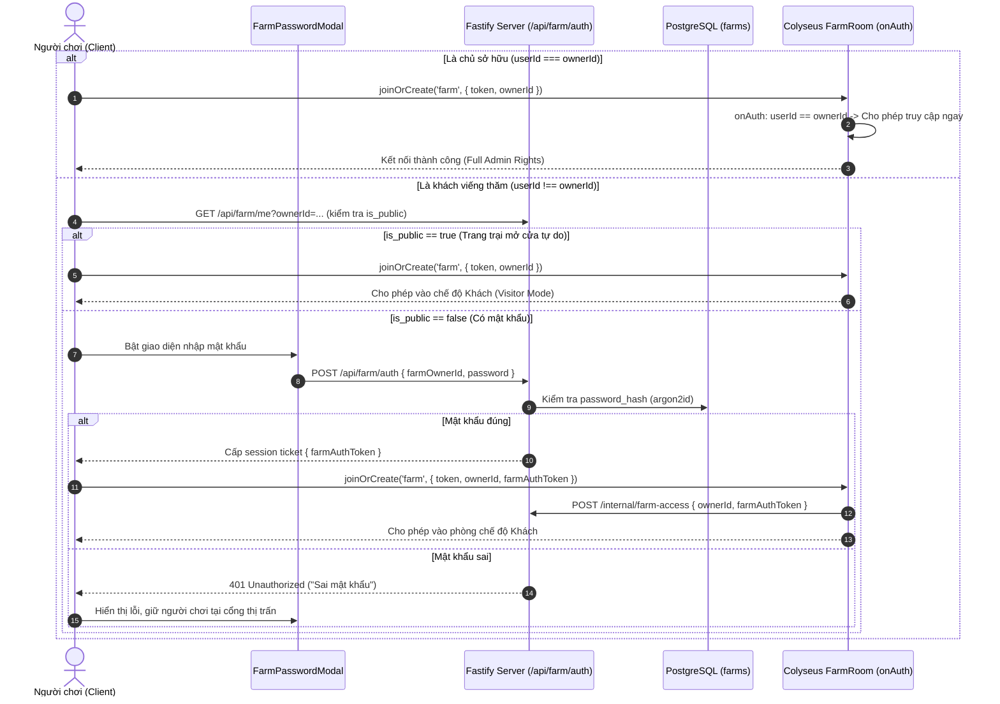

# Báo Cáo Khảo Sát Đặc Tả Kỹ Thuật: Hệ Thống Trang Trại Cá Nhân (Cozy Farm System)

- **Người thực hiện**: Spec Miner (`survey_spec_miner`)
- **Tài liệu đặc tả gốc**: `docs/farm_system_plan.pdf` (12 trang kỹ thuật), `ORIGINAL_REQUEST.md`, `AGENTS.md`
- **Mã định danh tác vụ**: Cozy Farm System Survey & Feature Mining
- **Thời gian lập**: 2026-10-02

---

## 1. Tổng Quan Kiến Trúc & Luồng Trải Nghiệm (Architecture & User Flow)

Hệ thống Trang Trại Cá Nhân là phân khu thế giới mở mới của Cozy Compute Social MMO, kết nối từ ngõ Tây thị trấn (Town West Portal) sang không gian nông thôn Nam Bộ.
Mọi tương tác liên quan đến kinh tế, tài sản, chu kỳ tăng trưởng cây trồng, chăn nuôi và nuôi trồng thủy sản đều tuân theo nguyên tắc **Server-Authoritative** (máy chủ là nguồn chân lý duy nhất, cấm tin tưởng client).

### 1.1 Luồng Di Chuyển & Cổng Vào Trang Trại (Gate & Access Control)
1. **Cổng Tây Thị Trấn (Town Scene -> Farm Portal)**:
   - Người chơi di chuyển sang mép trái bản đồ Thị Trấn (Town Scene).
   - Xuất hiện Cổng chào tre mộc mạc và biển chỉ dẫn *"Đường Vào Trang Trại"*.
   - Chạm vào vùng trigger kích hoạt chuyển tiếp sang Trang Trại.
2. **Xác định Quyền Sở Hữu (Ownership Verification)**:
   - **Trang trại của chính mình**: Bỏ qua mật khẩu, hệ thống chuyển thẳng vào `FarmScene` cá nhân và cấp quyền kết nối `FarmRoom` (`farm:${myUserId}`).
   - **Ghé thăm trang trại người khác**:
     - Nếu trang trại được chủ cài đặt `is_public = true`: Cho phép vào trực tiếp với quyền Khách (Visitor / Co-op Helpling).
     - Nếu trang trại cài đặt `is_public = false` (có mật khẩu): Hệ thống bật modal `FarmPasswordModal` (*"Nhập Mật Khẩu Trang Trại Của [Tên Chủ Nhà]"*).
     - Khách nhập đúng mật khẩu -> API cấp token xác thực -> Colyseus `FarmRoom` `onAuth` chấp thuận -> Vào trang trại khách.
     - Khách nhập sai mật khẩu -> Báo lỗi giao diện, giữ người chơi ở lại cổng thị trấn, không cho vào phòng.
3. **Phân Quyền Co-op (Co-op & Anti-Theft Policy)**:
   - **Chủ trang trại (Owner)**: Toàn quyền canh tác, mở đất, thu hoạch, chăm sóc vật nuôi, nâng cấp kho Silo, đổi mật khẩu.
   - **Khách ghé thăm (Visitor / Co-op Helpling)**:
     - Được tham quan, ngắm cảnh, di chuyển, chat và emote.
     - Được **tưới nước giúp cây** (`POST /api/farm/plots/water`), sau khi tưới thành công nhận điểm Tim thân thiện / Danh tiếng (Fame).
     - **NGHIÊM CẤM** khách thu hoạch trộm nông sản (`POST /api/farm/plots/harvest` kiểm tra quyền sở hữu phía server), không được mở khóa đất hay mua bán tiêu xài tiền của chủ trại.

---

## 2. Features Discovered (Danh Mục Tính Năng Khai Thác)

| # | Category | Feature | Description | Inputs | Outputs | Error Behavior | Discovered Via |
|---|----------|---------|-------------|--------|---------|----------------|----------------|
| 1 | Navigation | Town West Gate Portal | Mở rộng mép trái thị trấn, cổng tre + biển chỉ dẫn, trigger chuyển tiếp map sang FarmScene | Vị trí người chơi chạm mép Tây (x < boundary) | Chuyển cảnh `TownScene` -> `FarmScene` | Chặn nếu chưa đăng nhập | `farm_system_plan.pdf` p.1, 4, 11 |
| 2 | Security | Colyseus FarmRoom Instance | Phòng realtime cho từng trang trại `farm:${ownerId}` | `ownerId`, `token`, `farmAuthToken` | Kết nối WebSocket room, đồng bộ avatar & chat | Từ chối kết nối (code 4003/error) nếu không hợp lệ | `farm_system_plan.pdf` p.8, 10, 11 |
| 3 | Security | Farm Password & Privacy Settings | Cấu hình mật khẩu hoặc bật tắt chế độ công khai | `password` (string), `isPublic` (boolean) | Cập nhật cấu hình bảo mật trang trại | 401 nếu chưa login, 400 nếu mật khẩu không hợp lệ | `farm_system_plan.pdf` p.8, 10 |
| 4 | Security | Farm Visitor Authentication | Xác thực mật khẩu khi muốn ghé thăm trang trại người khác | `farmOwnerId`, `password` | Cấp token phiên vào phòng (`farmToken`) | 401 `invalid_password` / "Sai mật khẩu trang trại" | `farm_system_plan.pdf` p.8, 10 |
| 5 | Security | FarmPasswordModal UI | Modal nhập mã số/ký tự phong cách gỗ mộc, hỗ trợ bàn phím số và nút Esc | Chuỗi ký tự từ phím hoặc click chuột | Submit mật khẩu / Hủy quay về thị trấn | Hiển thị lỗi đỏ nếu nhập sai | `farm_system_plan.pdf` p.8, 11 |
| 6 | Cultivation | Grid Plot Management | Lưới 36 ô đất (4x4 hoặc 6x6, index 0..35) hiển thị trạng thái sinh trưởng | Tọa độ ô đất `plotIndex` (0..35) | Trạng thái trực quan: cỏ dại, đất khô, đất ướt, mầm non, trái chín | 400 nếu `plotIndex` vượt ngoài khoảng 0..35 | `farm_system_plan.pdf` p.4, 5, 9 |
| 7 | Cultivation | Plot Unlock with Idempotency | Mở khóa ô đất mới bằng Coin, chống double-charge qua Idempotency-Key | `plotIndex`, Header `Idempotency-Key` | Trừ Coin, đặt `is_unlocked = true` | 409 `insufficient_balance` nếu thiếu Coin; replay nếu trùng key | `farm_system_plan.pdf` p.5, 10, 12 |
| 8 | Cultivation | Tilling & Soil Moisture | Cuốc đất và tưới nước giữ ẩm; đất khô chuyển màu nâu sẫm khi tưới | `plotIndex` | Cập nhật `watered_at = now()`, kích hoạt tăng trưởng | Báo lỗi nếu ô đất chưa mở khóa | `farm_system_plan.pdf` p.4, 5, 10 |
| 9 | Cultivation | Seed Sowing (Gieo Hạt) | Gieo hạt giống từ kho Silo hoặc túi đồ vào ô đất trống | `plotIndex`, `cropId` | Trừ 1 hạt trong kho, ô đất chuyển sang `seed` | 400 nếu đất đã có cây, 404/400 nếu hết hạt giống | `farm_system_plan.pdf` p.5, 10 |
| 10 | Cultivation | Real-time Crop Growth | Sinh trưởng 3 giai đoạn: Mầm non -> Nhánh cây -> Trái chín theo timestamp server | Server clock & `watered_at` | Chuyển nấc `growth_stage` (`sprout`, `blooming`, `mature`) | Ngừng lớn nếu đất cạn nước; úa tàn nếu bỏ bê | `farm_system_plan.pdf` p.5, 9, 10 |
| 11 | Cultivation | Organic Bio-Fertilizer | Bón phân vi sinh thúc mầm giúp giảm 50% thời gian trưởng thành | `plotIndex`, `fertilizerItemId` | Đặt `is_fertilized = true`, rút ngắn 50% duration | Báo lỗi nếu đã bón phân trước đó | `farm_system_plan.pdf` p.5, 7, 9 |
| 12 | Cultivation | Crop Harvesting | Thu hoạch trái chín vàng lấp lánh (phím E), nông sản vào thẳng kho Silo | `plotIndex` | Chuyển nông sản vào kho, reset ô đất về đất trống | 400 nếu cây chưa chín, 403 nếu khách cố ý thu hoạch | `farm_system_plan.pdf` p.5, 8, 10 |
| 13 | Co-op | Helping Hand (Tưới Nước Hộ) | Khách viếng thăm tưới nước giúp cây trồng của bạn bè | `farmOwnerId`, `plotIndex` | Cập nhật độ ẩm cho cây, cộng Tim thân thiện / Fame cho khách | Chặn nếu ô đất không có cây hoặc đang ướt | `farm_system_plan.pdf` p.8, 10 |
| 14 | Barns | Poultry Coop (Chuồng Gia Cầm) | Nuôi gà ri, vịt xiêm, chim cút; ổ rơm lót trứng; anim mổ thóc & bong bóng kêu | Thức ăn gia cầm (thóc bồ) | Sản sinh Trứng gà ta, Trứng vịt lộn, Lông vũ | Báo lỗi nếu chưa đến chu kỳ hoặc hết thức ăn | `farm_system_plan.pdf` p.5, 6, 10 |
| 15 | Barns | Cattle Pasture (Chuồng Bò) | Nuôi bò vàng Đồng Nai, bò sữa Hà Lan; máng cỏ; anim nhai cỏ, vẫy đuôi, lắc chuông | Rơm khô thượng hạng | Cho Sữa tươi nguyên chất, Phân chuồng | Giảm happiness nếu bỏ đói quá lâu | `farm_system_plan.pdf` p.6, 10 |
| 16 | Barns | Pig Pen (Chuồng Heo Mọi) | Nuôi heo sọc dưa, heo ỉ; bãi bùn ẩm ướt, anim heo lăn bùn & ngủ ngáy "zzz" | Cám bắp lên men | Cho Thịt heo sạch / Da heo / Mỡ heo | Giảm sản lượng nếu không cho ăn | `farm_system_plan.pdf` p.6, 10 |
| 17 | Barns | Goat & Sheep Pen (Chuồng Dê & Cừu) | Nuôi dê Bách Thảo, cừu lấy lông; cầu dốc gỗ, máng rơm cao; anim leo trèo | Cỏ khô / rơm | Cho Sữa dê tươi, Cuộn len cừu mịn | Không cho sản phẩm nếu đói | `farm_system_plan.pdf` p.6, 10 |
| 18 | Barns | Animal Feeding & Happiness | Cho thú ăn qua API, tăng điểm vui vẻ (happiness 0..100) | `animalId`, `feedItemId` | Cập nhật `fed_at = now()`, tăng `happiness` | 400 nếu thức ăn không phù hợp loài | `farm_system_plan.pdf` p.6, 9, 10 |
| 19 | Silo | Farm Warehouse Storage | Kho hàng chuyên dụng nông trại tách bạch hoàn toàn với Backpack cá nhân | `farmId` | Lưu trữ tập trung nông sản, con giống, vật tư số lượng lớn | Báo đầy kho khi đạt `warehouse_capacity` | `farm_system_plan.pdf` p.6, 9 |
| 20 | Silo | Warehouse Capacity Upgrades | Nâng cấp sức chứa kho từ 100 ngăn khởi điểm (+50 ô/lần) bằng Coin | Idempotency-Key | Tăng `warehouse_capacity += 50`, trừ Coin | 409 nếu không đủ Coin | `farm_system_plan.pdf` p.6, 9, 11 |
| 21 | Silo | 4-Tab Categorization | Phân loại thông minh 4 danh mục: Nông sản, Chăn nuôi, Hạt/Con giống, Vật tư | Chuyển tab trên UI | Lọc danh sách hiển thị vật phẩm theo tab | Không có | `farm_system_plan.pdf` p.6, 11 |
| 22 | Shop | Bác Sáu Supplies Store | Mua hạt giống, con giống, thức ăn gia súc, phân bón sinh học bằng Coin | `itemId`, `quantity`, Idempotency-Key | Trừ Coin, thêm vật phẩm vào kho Silo hoặc thả vào chuồng | 409 thiếu Coin, 400 đầy kho Silo | `farm_system_plan.pdf` p.7, 10 |
| 23 | Shop | Wholesale Produce Sell | Bán sỉ số lượng lớn nông sản thu hoạch và sản phẩm chăn nuôi lấy Coin | `itemId`, `quantity` | Trừ vật phẩm kho Silo, cộng Coin qua ledger | 400 nếu số lượng vượt quá tồn kho | `farm_system_plan.pdf` p.7, 10 |
| 24 | Shop | Daily Market Contracts | Bảng hợp đồng đơn đặt hàng hôm nay (giao nộp trứng/lúa), thưởng +25% Coin & Fame | `contractId`, nộp nông sản yêu cầu | Thưởng Coin (+25%) + Điểm kinh nghiệm Nông Dân | 400 nếu không đủ số lượng nông sản yêu cầu | `farm_system_plan.pdf` p.7, 10 |
| 25 | Aquaculture | Fish Pond Stocking | Thả cá giống (Cá tra, bống tượng, lóc bông, tôm càng xanh) vào ao nhà | `fishSpecies`, `quantity` | Tạo bản ghi trong `farm_pond_fishes` | Báo lỗi nếu vượt mật độ ao | `farm_system_plan.pdf` p.7, 9, 10 |
| 26 | Aquaculture | Aquaculture Daily Feeding | Rải thức ăn thủy sản mỗi ngày, nuôi dưỡng cá lớn nhanh | `feedItemId` | Cập nhật `fed_at`, kích thích tăng trọng lượng `current_weight_kg` | Không tăng trọng nếu bỏ đói | `farm_system_plan.pdf` p.7, 9, 10 |
| 27 | Aquaculture | Fish Growth & Weight Tracking | Thanh đo trọng lượng: cá nhỡ -> cá trưởng thành -> cá đại đặc sản | Timestamp tính toán phía server | Cập nhật `current_weight_kg` theo công thức tăng trọng | Cố định ở ngưỡng tối đa của loài | `farm_system_plan.pdf` p.7, 9 |
| 28 | Aquaculture | Dragnet & Hand Rod Harvest | Thu hoạch thủy sản hàng loạt bằng lưới kéo hoặc câu tay thư giãn cùng bạn bè | Chọn chế độ lưới kéo / câu cần | Nhận cá thương phẩm vào kho Silo / bán sỉ | Báo lỗi nếu cá còn quá non | `farm_system_plan.pdf` p.7, 10 |
| 29 | Aquaculture | Waterwheel Aerator | Guồng quay sục khí xoay liên tục bắn bọt trắng xóa cung cấp dưỡng khí oxy | Phụ thuộc trạng thái ao | Hiệu ứng bọt khí nước Pure Canvas sống động | Không có | `farm_system_plan.pdf` p.7, 11 |
| 30 | Pure Canvas Art | 2.5D Rural Canvas Rendering | Rasterization scanline, pixel snap, không dùng ảnh ngoài cho toàn bộ cảnh quan | Renderer loop của Phaser | Khung cảnh làng quê Nam Bộ sắc nét, ấm cúng | Không nạp được texture -> fallback hình khối | `farm_system_plan.pdf` p.3, 4, 11 |
| 31 | Scene Layout | FarmScene.ts Scene World | Map nông trại với camera clamping, collision blocker, âm thanh đồng quê | Phím điều khiển WASD, E | Thế giới game mượt mà 60fps | Chặn di chuyển xuyên vật cản | `farm_system_plan.pdf` p.4, 11 |
| 32 | UI/HUD | Plot Detail & Farming HUD | Hiển thị độ ẩm đất, thanh tiến trình cây, nút chăm sóc / thu hoạch | Click hoặc nhấn E tại ô đất | Mở panel thao tác nhanh | Không có | `farm_system_plan.pdf` p.11, 12 |
| 33 | UI/HUD | Farm Warehouse Panel | Quản lý kho Silo 4 tab, nút nâng cấp sức chứa kho, xem chi tiết vật phẩm | Nhấn E tại Nhà kho Silo | Hiển thị danh mục và sức chứa | Không có | `farm_system_plan.pdf` p.6, 11, 12 |
| 34 | UI/HUD | Bác Sáu Shop Panel | Gian hàng mua vật tư và bảng giao nộp hợp đồng hôm nay | Nhấn E tại Sạp Bác Sáu | Mở modal mua bán và hợp đồng | Không có | `farm_system_plan.pdf` p.7, 11, 12 |

---

## 3. Chi Tiết Cơ Chế Canh Tác Cây Trồng (Crops & Land Plots Spec)

### 3.1 Cấu Trúc Lưới & Quy Hoạch Mẫu Đất
- **Quy mô ô đất**: 36 ô đất nông nghiệp (`plot_index` từ `0` đến `35`), chia thành cụm lưới (Fields) 6x6 (hoặc các luống phụ 4x4).
- **Mở khóa ban đầu**:
  - Khi người chơi mới tạo trang trại (`GET /api/farm/me`), mặc định mở khóa sẵn 4 ô đất khởi nghiệp (`plot_index` 0..3: `is_unlocked = true`, `unlock_price = 0`).
  - Các ô đất còn lại từ 4 đến 35 ban đầu ở trạng thái `LOCKED` (`is_unlocked = false`), có cọc cắm biển ổ khóa hiển thị giá tiền Coin cần để khai hoang.
- **Giá mở khóa đất (Unlock Price Formula)**:
  - Tăng dần theo từng bậc để tạo mục tiêu kinh tế lũy tiến:
    - Ô 4 - 7 (Bậc 1): `500 Coin` / ô.
    - Ô 8 - 15 (Bậc 2): `1,500 Coin` / ô.
    - Ô 16 - 23 (Bậc 3): `3,000 Coin` / ô.
    - Ô 24 - 35 (Bậc 4): `5,000 Coin` / ô.

### 3.2 Chu Kỳ 8 Trạng Thái Ô Đất & Sinh Trưởng Cây Trồng
1. `LOCKED`: Ô đất hoang dại, mọc cỏ dại um tùm, đá cuội, cọc gỗ cắm ổ khóa kèm giá Coin. Đứng gần nhấn E để xác nhận mua & khai hoang.
2. `UNTILLED`: Đất hoang đã mở khóa nhưng chưa cuốc. Bằng phẳng, có ít cỏ vụn. Cần dùng cuốc làm tơi xốp.
3. `TILLED_DRY`: Đất đã cuốc thành luống xới sẵn, màu nâu sáng `#8c6747`. Cần tưới nước để gieo hạt hoặc giúp hạt nảy mầm.
4. `TILLED_WET`: Đất đã tưới nước, sẫm màu nâu đen `#5c3a21`. Độ ẩm duy trì trong một chu kỳ (ví dụ: 12 - 24 giờ thực). Cây trồng chỉ tích lũy thời gian sinh trưởng khi đất đang ở trạng thái ẩm (`is_wet`).
5. `GROWING`: Cây đang trong chu kỳ lớn với 3 nấc hình ảnh Pure Canvas:
   - Nấc 1 (`seed` / `sprout`): Hạt nảy mầm non 2 lá nhỏ màu xanh non `#a3e635`.
   - Nấc 2 (`branching`): Cây con ra nhánh, lá xum xuê `#15803d`, thân cây óng ả `#65a30d`.
   - Nấc 3 (`blooming`): Cây đơm hoa hoặc kết quả non (dưa hấu nhỏ, quả cà chua xanh).
6. `HARVESTABLE` (`mature`): Cây đã trưởng thành chín mọng. Bông lúa trĩu hạt vàng ruộm `#facc15`, dưa hấu to tròn bóng bẩy, cà chua đỏ mọng `#dc2626`. Phát ra hiệu ứng hạt lấp lánh (sparkling particle). Đứng gần nhấn E để gặt hái. Nông sản chuyển thẳng vào kho Silo.
7. `FERTILIZED`: Ô đất được bón phân vi sinh hoặc trùn quế. Mặt đất có ánh sáng phấn hữu cơ lấp lánh `#3b2314`. Giảm **50% thời gian trưởng thành** của cây (`growthDuration * 0.5`).
8. `WITHERED`: Cây bị bỏ khô hạn quá lâu mà không được tưới nước sau khi hết độ ẩm sẽ chuyển sang héo rũ, cần dọn dẹp để gieo đợt mới.

### 3.3 Danh Mục Hạt Giống & Nông Sản (Crop Catalog & Timing)

| Item ID Hạt | Tên Cây Trồng | Giá Hạt (Shop) | Thời Gian Lớn (Cơ Bản) | Khi Có Phân Bón (-50%) | Nông Sản Thu Hoạch | Item ID Nông Sản | Sản Lượng/Ô | Giá Bán Sỉ (Coin) |
|-------------|---------------|----------------|------------------------|------------------------|--------------------|------------------|-------------|-------------------|
| `seed_rice` | Lúa nước | 30c | 15 phút (900s) | 7.5 phút (450s) | Bó lúa vàng | `crop_rice` | 3 - 5 bó | 15c / bó |
| `seed_corn` | Bắp ngô ngọt | 50c | 30 phút (1800s) | 15 phút (900s) | Bắp ngô tươi | `crop_corn` | 3 - 4 bắp | 28c / bắp |
| `seed_tomato` | Cà chua bi | 45c | 20 phút (1200s) | 10 phút (600s) | Cà chua bi mọng | `crop_tomato` | 4 - 6 quả | 18c / quả |
| `seed_chili` | Ớt hiểm | 60c | 45 phút (2700s) | 22.5 phút (1350s) | Ớt hiểm cay | `crop_chili` | 5 - 8 quả | 16c / quả |
| `seed_watermelon` | Dưa hấu ruột đỏ | 120c | 60 phút (3600s) | 30 phút (1800s) | Dưa hấu khổng lồ | `crop_watermelon` | 1 - 2 quả | 110c / quả |

*(Lưu ý: Thời gian sinh trưởng hoàn toàn tính toán server-authoritative dựa vào hiệu số `now() - planted_at` kết hợp điều kiện `watered_at` còn hiệu lực).*

---

## 4. Chi Tiết Cụm Chuồng Trại & Chăn Nuôi (Livestock & Barns Spec)

Không nuôi nhốt tạp nham trong một chuồng mà chia thành 4 khu vực chuồng trại riêng biệt với cảnh quan và hoạt cảnh đặc trưng:

### 4.1 Chuồng Gia Cầm (Poultry Coop)
- **Kiến trúc**: Khung rào gỗ có lưới mắt cáo, máng thóc bằng tre chẻ đôi, các ổ rơm lót trứng tròn xoe nằm dưới mái tranh che mưa nắng.
- **Vật nuôi tiếp nhận**:
  - Gà ri (`chicken`): Mua gà con giá `200 Coin`.
  - Vịt xiêm (`duck`): Mua vịt con giá `220 Coin`.
  - Chim cút (`quail`): Trứng nhỏ, sinh sản nhanh.
- **Thức ăn**: Thóc bồ (`feed_grain`).
- **Hoạt ảnh (2-frame animation)**:
  - Khung 1: Đứng mổ thóc lắt nhắt xuống đất.
  - Khung 2: Ngẩng đầu xù lông cánh, thỉnh thoảng phát bong bóng tiếng kêu *"Cục tác!"* hoặc *"Cạp cạp!"*.
- **Sản phẩm thu hoạch**:
  - Trứng gà ta (`product_chicken_egg`): Sản xuất mỗi 30 phút nếu được cho ăn.
  - Trứng vịt lộn (`product_duck_egg`): Bổ dưỡng, giá bán cao.
  - Lông vũ (`product_feather`): Vật liệu may mặc / chế tác.

### 4.2 Chuồng Bò & Bê Sữa (Cattle Pasture)
- **Kiến trúc**: Mái che cột gỗ to bản vững chãi, máng cỏ khô bằng gỗ dài, ụ rơm vàng cao chất đống, bò đeo chuông đồng lắc leng keng.
- **Vật nuôi tiếp nhận**:
  - Bò vàng Đồng Nai (`cow_yellow`): Bò thịt và kéo cày truyền thống.
  - Bò sữa Hà Lan (`cow_dairy`): Bò lang trắng đen cho lượng sữa dồi dào. Mua bê con giá `1,800 Coin`.
- **Thức ăn**: Rơm khô thượng hạng (`feed_hay`).
- **Hoạt ảnh (2-frame animation)**:
  - Khung 1: Đầu hơi cúi nhai cỏ chậm rãi, hàm đảo qua lại.
  - Khung 2: Vẫy đuôi xua ruồi muỗi, chuông đồng trên cổ rung nhẹ.
- **Sản phẩm thu hoạch**:
  - Sữa tươi nguyên chất (`product_cow_milk`): Bình sữa thủy tinh đóng nắp vải.
  - Phân chuồng ủ hoai (`product_manure`): Dùng bón ruộng hoặc chế biến phân bón sinh học.

### 4.3 Chuồng Heo Mọi (Pig Pen)
- **Kiến trúc**: Hàng rào gỗ thấp đan chéo, có vũng sình bùn ẩm ướt ở góc chuồng cho heo tắm mát hạ nhiệt, máng cám tròn bằng gốm sứ.
- **Vật nuôi tiếp nhận**:
  - Heo sọc dưa (`pig_striped`): Heo rừng lai nhỏ con lanh lợi.
  - Heo ỉ Nam Bộ (`pig_i`): Heo đen bụng xệ mập mạp. Mua heo giống giá `800 Coin`.
- **Thức ăn**: Cám bắp lên men (`feed_corn_mash`).
- **Hoạt ảnh (2-frame animation)**:
  - Khung 1: Nằm ủn ỉn trong bãi bùn lười biếng.
  - Khung 2: Ngủ thở đều, phát bong bóng chữ *"zzz"*, thỉnh thoảng giật tai.
- **Sản phẩm thu hoạch**:
  - Thịt heo tươi sạch (`product_pork`).
  - Da heo & mỡ heo (`product_pig_leather`).

### 4.4 Chuồng Dê Núi & Cừu (Goat & Sheep Pen)
- **Kiến trúc**: Bục dốc gỗ nhiều tầng cho dê leo trèo giải trí (tập tính thích cao của loài dê), máng treo rơm khô trên cao tránh ẩm.
- **Vật nuôi tiếp nhận**:
  - Dê Bách Thảo (`goat`): Dê tai cụp lông mượt, cho sữa thơm ngon.
  - Cừu lấy lông (`sheep`): Cừu lông xoăn bồng bềnh như mây.
- **Thức ăn**: Cỏ tươi, rơm khô.
- **Hoạt ảnh (2-frame animation)**:
  - Khung 1: Đứng trên bục gỗ cao nghểnh cổ ngó nghiêng.
  - Khung 2: Nhún nhảy xuống bục gặm cỏ.
- **Sản phẩm thu hoạch**:
  - Sữa dê tươi tiệt trùng (`product_goat_milk`).
  - Cuộn len cừu mịn (`product_wool`): Dùng cho nghề dệt vải thị trấn.

### 4.5 Chỉ Số Vui Vẻ & Cơ Chế Cho Ăn (Livestock Mechanics)
- Điểm vui vẻ: `happiness` từ `0` đến `100`.
- Mỗi ngày không cho ăn (`now() - fed_at > 24h`): `happiness` giảm 20 điểm/ngày.
- Khi `happiness >= 60`: Con vật cho sản lượng định kỳ đều đặn (`last_yield_at`).
- Khi `happiness < 30`: Con vật đình trệ sinh sản, phát bong bóng ủ rũ hình giọt nước mắt.
- Gọi `POST /api/farm/animals/feed` để tiêu thụ 1 đơn vị thức ăn tương ứng trong kho Silo, cập nhật `fed_at = now()` và hồi phục +30 `happiness`.

---

## 5. Nhà Kho Nông Trại Chuyên Dụng (Farm Warehouse & Silo)

### 5.1 Vị Trí & Kiến Trúc
- Nằm ngay bên phải lối vào chính trang trại.
- Nhà gỗ dầu vững chãi, mái lợp ngói âm dương rêu phong, phía trước cửa đặt cân bàn cổ điển để cân tải trọng nông sản, xung quanh có các bao tải thóc đầy ắp và bù nhìn rơm đội nón lá.

### 5.2 Dung Lượng & Cơ Chế Nâng Cấp Kho
- **Khởi điểm**: 100 ngăn chứa (`warehouse_capacity = 100`).
- **Tách biệt hoàn toàn**: Không gộp chung với Túi Đồ Cá Nhân (Backpack) của người chơi. Điều này bảo vệ trải nghiệm của người chơi, giúp họ tự do tích lũy hàng tấn lúa, ngô, trứng, cá mà không lo nghẽn túi đồ dạo phố.
- **Nâng cấp bằng Coin**: Mỗi lần nâng cấp tăng thêm **+50 ô chứa** (`+50 slots/tier`).
  - Cấp 1 (100 -> 150 ô): `1,000 Coin`
  - Cấp 2 (150 -> 200 ô): `2,500 Coin`
  - Cấp 3 (200 -> 250 ô): `5,000 Coin`
  - Cấp 4 (250 -> 300 ô): `10,000 Coin`
  - Cấp 5+ (Mỗi nấc tiếp theo): `+15,000 Coin`

### 5.3 Phân Loại 4 Tab Thông Minh
Bảng điều khiển kho phân tách thành 4 tab rõ ràng:
1. 🌾 **Nông sản gặt hái (`crop`)**: Bó lúa, bắp ngô, quả dưa hấu, cà chua bi, ớt hiểm...
2. 🥚 **Sản phẩm chăn nuôi (`animal_product`)**: Trứng gà ta, trứng vịt lộn, sữa bò tươi, sữa dê, cuộn len cừu, lông vũ, phân chuồng...
3. 🌱 **Túi hạt giống & Con giống (`seed`)**: Hạt giống lúa, hạt bắp, hạt dưa hấu, hạt cà chua, hạt ớt, gà con con, vịt con, heo giống, bê con...
4. 🧪 **Vật tư & Phân bón (`supply`)**: Thóc bồ, cám bắp lên men, rơm khô, thức ăn thủy sản, phân vi sinh, phân trùn quế, bình tưới nước...

---

## 6. Tiệm Nông Nghiệp Bác Sáu & Hợp Đồng Đơn Đặt Hàng (Shop & Contracts)

### 6.1 NPC & Không Gian Quầy Hàng
- Quầy sạp gỗ ven đường rợp bóng mát dưới tược lá cây mít sai trĩu quả, có chõng tre cho bà con lối xóm ngồi uống nước chè.
- **NPC Bác Sáu**:
  - Trang phục: Áo bà ba nâu sồng hoặc đen, quấn khăn rằn rằn ri Nam Bộ quanh cổ, đội nón lá chóp nhọn.
  - Tính cách: Hiền từ, hào sảng, xưng hô thân mật ("cháu", "bác"), sẵn sàng tư vấn kỹ thuật nông nghiệp canh tác, nhắc nhở lịch tưới nước cho cây.

### 6.2 Danh Mục Hàng Hóa Bán Ra (Catalog Supplies - Buy)

| Mã Vật Phẩm | Tên Vật Phẩm | Phân Loại | Giá Mua (Coin) | Mô Tả Tác Dụng |
|-------------|--------------|-----------|----------------|----------------|
| `seed_rice` | Hạt giống lúa nước | Hạt giống | 30c | Giống lúa ST dẻo thơm, lớn trong 15 phút |
| `seed_corn` | Hạt giống bắp ngô ngọt | Hạt giống | 50c | Bắp nếp ngọt bùi, lớn trong 30 phút |
| `seed_watermelon` | Hạt giống dưa hấu ruột đỏ | Hạt giống | 120c | Dưa ruột đỏ mọng nước giải nhiệt hè |
| `seed_tomato` | Hạt giống cà chua bi | Hạt giống | 45c | Chùm cà chua nhỏ xíu đỏ au nhiều vitamin |
| `seed_chili` | Hạt giống ớt hiểm | Hạt giống | 60c | Ớt chỉ thiên cay nồng Nam Bộ |
| `stock_chicken` | Gà con lông vàng | Con giống | 200c | Nuôi tại Chuồng Gia Cầm, lớn lên đẻ trứng |
| `stock_duck` | Vịt con xiêm | Con giống | 220c | Nuôi tại Chuồng Gia Cầm, cho trứng vịt lộn |
| `stock_pig` | Heo giống sọc dưa | Con giống | 800c | Thả nuôi tại Chuồng Heo Mọi, thích tắm bùn |
| `stock_calf` | Bê con sữa Hà Lan | Con giống | 1,800c | Nuôi tại Chuồng Bò, lớn lên cho sữa tươi |
| `feed_grain` | Thóc bồ sạch | Thức ăn | 20c | Thức ăn bổ dưỡng cho đàn gia cầm gà vịt |
| `feed_corn_mash`| Cám bắp lên men | Thức ăn | 40c | Món khoái khẩu giúp heo béo tròn mau lớn |
| `feed_hay` | Rơm khô thượng hạng | Thức ăn | 35c | Rơm thơm lúa mùa cho bò sữa và cừu dê |
| `feed_fish` | Thức ăn thủy sản đậm đặc | Thức ăn | 25c | Viên nổi giàu đạm giúp cá ao tăng trọng nhanh |
| `fertilizer_microbe` | Phân vi sinh thúc mầm | Phân bón | 40c | Thúc đẩy quang hợp, giảm 50% thời gian lớn |
| `fertilizer_worm`| Phân trùn quế cao cấp | Phân bón | 60c | Tăng độ phì nhiêu, tăng 50% sản lượng gặt hái |

### 6.3 Quầy Thu Mua Sỉ & Bảng Hợp Đồng Hôm Nay (Sell & Contracts)
1. **Thu mua sỉ thông thường (`Wholesale Sell`)**:
   - Người chơi có thể bán bất kỳ lượng nông sản, trứng, sữa hay cá thu hoạch từ kho Silo với mức giá niêm yết rõ ràng để đổi lấy Coin.
2. **Bảng "Hợp Đồng Đơn Đặt Hàng Hôm Nay" (`Daily Supply Contracts`)**:
   - Hệ thống phát sinh đơn đặt hàng mỗi ngày từ các nhà hàng, thương lái thị trấn (ví dụ: Quán Cơm Gà Xối Mỡ 68, Quán Bida, Trường DNTU).
   - Ví dụ nhiệm vụ giao nộp:
     - Đơn 1: *"Cung cấp 50 quả trứng gà ta cho tiệm bánh mì"*
     - Đơn 2: *"Giao 100 bó lúa mùa cho kho lương thực"*
     - Đơn 3: *"Cung cấp 20 quả dưa hấu ruột đỏ cho hội chợ quê"*
   - **Phần thưởng đặc biệt**:
     - **Thưởng thêm +25% Coin** so với giá bán sỉ thông thường.
     - **Điểm kinh nghiệm Nông Dân / Danh tiếng (Fame)**: Giúp nâng cấp danh hiệu Nông Dân Xuất Sắc.

---

## 7. Ao Nuôi Cá Thủy Sản & Guồng Nước (Aquaculture Pond Spec)

### 7.1 Điểm Khác Biệt Cốt Lõi Với Hồ Bến Lai
- **Hồ Bến Lai ngoài thị trấn**: Hoạt động câu cá tự nhiên hoang dã, thời gian phản xạ mini-game, cá ngẫu nhiên theo trọng số cần câu.
- **Ao Nông Trại Cá Nhân**: Là **Hệ Thống Thủy Sản Nuôi Trồng Chuyên Nghiệp (Aquaculture System)**:
  - Chủ trang trại chủ động mua cá bột / con giống thả xuống ao.
  - Cho ăn định kỳ hàng ngày bằng thức ăn chuyên dụng.
  - Kiểm soát trọng lượng, tăng trưởng sinh khối từ nhỏ đến cá đại đặc sản.
  - Chủ động phương thức thu hoạch: Lưới kéo hàng loạt hoặc câu tay giải trí cùng bạn bè.

### 7.2 Danh Mục Loài Thủy Sản Nuôi Trồng

| Mã Giống Cá | Tên Loài | Giá Con Giống | Cân Nặng Ban Đầu | Cân Nặng Trưởng Thành | Ngưỡng "Đại Đặc Sản" | Thời Gian Nuôi Chuẩn |
|-------------|----------|---------------|------------------|-----------------------|-----------------------|-----------------------|
| `fish_tra` | Cá tra giống | 80c | 0.2 kg | 1.8 - 2.5 kg | > 4.0 kg | 24 giờ |
| `fish_basa` | Cá basa bông lau | 100c | 0.2 kg | 1.5 - 2.2 kg | > 3.5 kg | 28 giờ |
| `fish_loc` | Cá lóc bông (cá chuối) | 150c | 0.15 kg | 1.2 - 2.0 kg | > 3.0 kg | 36 giờ |
| `fish_tom_cang` | Tôm càng xanh sông Tiền | 200c | 0.05 kg | 0.3 - 0.5 kg | > 0.8 kg | 48 giờ |

### 7.3 Cơ Chế Tăng Trọng Lượng & Cho Ăn
- Trọng lượng hiện tại: `current_weight_kg`.
- Khi người chơi rải thức ăn thủy sản (`POST /api/farm/pond/stock` hoặc route cho ăn ao cá):
  - Ao được cập nhật `fed_at = now()`.
  - Trong vòng 24 giờ sau khi cho ăn, cá tích lũy tăng trọng theo hệ số:
    $$\Delta W = W_{\text{base\_rate}} \times (1 + \text{aerator\_bonus})$$
  - Nếu không cho ăn, cá ngừng tăng trọng lượng.
- **Các mốc giai đoạn cá trong ao**:
  - Cá nhỡ (Juvenile): $< 50\%$ trọng lượng trưởng thành.
  - Cá trưởng thành (Adult / Market Size): $50\% - 100\%$ trọng lượng trưởng thành.
  - Cá đại đặc sản (Giant Specialty): Vượt trọng lượng chuẩn, giá trị thương phẩm gấp 2.5 lần!

### 7.4 Phương Thức Thu Hoạch & Guồng Nước Oxy
1. **Lưới kéo hàng loạt (Dragnet Bulk Harvest)**:
   - Dành cho chủ trại khi đàn cá đạt lứa trưởng thành. Thu toàn bộ cá đủ cân nặng vào kho Silo để bán sỉ hoặc hoàn thành hợp đồng thu mua.
2. **Câu tay thư giãn (Hand-rod Angling with Friends)**:
   - Cho phép chủ nhà và bạn bè viếng thăm cầm cần câu đứng trên cầu khỉ hoặc chòi lá dừa câu cá ao nhà tiêu khiển.
3. **Guồng nước sục khí (Paddlewheel Aerator)**:
   - Đặt ở giữa ao, guồng cánh quạt 4 cánh xoay tròn liên tục tạo bọt nước trắng xóa.
   - Hiệu ứng: Cung cấp oxy hòa tan giúp cá khỏe mạnh, giảm 15% thời gian nuôi.

---

## 8. Cơ Chế Bảo Mật Phòng & Quyền Hạn Co-op (Security & Colyseus FarmRoom)

### 8.1 Kiến Trúc Colyseus FarmRoom
- Đăng ký room definition trong `apps/realtime/src/index.ts`:
  ```ts
  gameServer.define('farm', FarmRoom).filterBy(['ownerId']);
  ```
- Phòng phân tách theo từng chủ sở hữu: `farm:${ownerId}`.

### 8.2 Quy Trình Xác Thực onAuth Phía Server


### 8.3 Bảng Ma Trận Phân Quyền Chi Tiết (Permission Matrix)

| Hành Động | Chủ Sở Hữu (Owner) | Khách Viếng Thăm (Visitor) | Cơ Chế Bảo Vệ Server-Side |
|-----------|--------------------|----------------------------|----------------------------|
| Vào phòng không cần mật khẩu | CÓ | KHÔNG (phải nhập pass nếu private) | Colyseus `onAuth` |
| Di chuyển, Chat, Thả Emote | CÓ | CÓ | Broadcast room chuẩn |
| Mua & Mở khóa ô đất (`/plots/unlock`) | CÓ | KHÔNG (403 Forbidden) | Kiểm tra `user.id === farm.user_id` |
| Cuốc đất & Gieo hạt (`/plots/plant`) | CÓ | KHÔNG (403 Forbidden) | Kiểm tra `user.id === farm.user_id` |
| Tưới nước cho cây (`/plots/water`) | CÓ | **CÓ (Cơ chế Phụ Giúp Co-op)** | Ghi nhận trợ giúp, thưởng Tim/Fame |
| Thu hoạch nông sản (`/plots/harvest`) | CÓ | **KHÔNG (Chống trộm cắp)** | 403 `forbidden_harvest` nếu không phải chủ |
| Cho vật nuôi ăn (`/animals/feed`) | CÓ | KHÔNG (Trừ khi bật quyền Co-op) | Kiểm tra quyền sở hữu kho lương thực |
| Thả cá ao (`/pond/stock`) | CÓ | KHÔNG (403 Forbidden) | Kiểm tra quyền sở hữu |
| Rút nông sản / Bán sỉ tại Bác Sáu | CÓ | KHÔNG (Chỉ bán đồ kho mình) | Kho nông sản liên kết theo `farm_id` |
| Nâng cấp kho Silo (`/warehouse/upgrade`) | CÓ | KHÔNG (403 Forbidden) | Trừ tiền chính chủ |
| Đổi mật khẩu trang trại (`PUT /settings`) | CÓ | KHÔNG (403 Forbidden) | Kiểm tra `user.id === farm.user_id` |

---

## 9. Cấu Trúc Database Schema (PostgreSQL)

Hệ thống bổ sung migration mới `apps/api/migrations/0005_cozy_farm.sql` bao gồm 5 bảng chuẩn hóa:

```sql
-- 1. Bảng FARMS: Quản lý thông tin gốc của trang trại
CREATE TABLE farms (
  id uuid PRIMARY KEY DEFAULT gen_random_uuid(),
  user_id uuid NOT NULL UNIQUE REFERENCES users(id) ON DELETE CASCADE,
  password_hash text,
  is_public boolean NOT NULL DEFAULT true,
  warehouse_capacity integer NOT NULL DEFAULT 100 CHECK (warehouse_capacity >= 100),
  created_at timestamptz NOT NULL DEFAULT now(),
  updated_at timestamptz NOT NULL DEFAULT now()
);
CREATE INDEX farms_user_idx ON farms (user_id);

-- 2. Bảng FARM_PLOTS: Quản lý 36 mẫu đất canh tác
CREATE TABLE farm_plots (
  id uuid PRIMARY KEY DEFAULT gen_random_uuid(),
  farm_id uuid NOT NULL REFERENCES farms(id) ON DELETE CASCADE,
  plot_index integer NOT NULL CHECK (plot_index BETWEEN 0 AND 35),
  is_unlocked boolean NOT NULL DEFAULT false,
  unlock_price integer NOT NULL DEFAULT 0 CHECK (unlock_price >= 0),
  crop_id text,
  planted_at timestamptz,
  watered_at timestamptz,
  is_fertilized boolean NOT NULL DEFAULT false,
  growth_stage text NOT NULL DEFAULT 'seed' CHECK (growth_stage IN ('seed', 'sprout', 'blooming', 'mature', 'withered')),
  UNIQUE (farm_id, plot_index)
);
CREATE INDEX farm_plots_farm_idx ON farm_plots (farm_id);

-- 3. Bảng FARM_ANIMALS: Quản lý đàn gia súc & gia cầm
CREATE TABLE farm_animals (
  id uuid PRIMARY KEY DEFAULT gen_random_uuid(),
  farm_id uuid NOT NULL REFERENCES farms(id) ON DELETE CASCADE,
  animal_type text NOT NULL CHECK (animal_type IN ('chicken', 'duck', 'cow', 'pig', 'goat')),
  name text NOT NULL DEFAULT '',
  fed_at timestamptz,
  happiness integer NOT NULL DEFAULT 100 CHECK (happiness BETWEEN 0 AND 100),
  last_yield_at timestamptz,
  created_at timestamptz NOT NULL DEFAULT now()
);
CREATE INDEX farm_animals_farm_idx ON farm_animals (farm_id);

-- 4. Bảng FARM_WAREHOUSE_ITEMS: Nhà kho Silo nông sản tách bạch độc lập
CREATE TABLE farm_warehouse_items (
  id uuid PRIMARY KEY DEFAULT gen_random_uuid(),
  farm_id uuid NOT NULL REFERENCES farms(id) ON DELETE CASCADE,
  item_id text NOT NULL,
  category text NOT NULL CHECK (category IN ('crop', 'animal_product', 'seed', 'supply')),
  quantity integer NOT NULL DEFAULT 0 CHECK (quantity >= 0),
  updated_at timestamptz NOT NULL DEFAULT now(),
  UNIQUE (farm_id, item_id)
);
CREATE INDEX farm_warehouse_farm_idx ON farm_warehouse_items (farm_id, category);

-- 5. Bảng FARM_POND_FISHES: Quản lý cá nuôi trồng ao nhà
CREATE TABLE farm_pond_fishes (
  id uuid PRIMARY KEY DEFAULT gen_random_uuid(),
  farm_id uuid NOT NULL REFERENCES farms(id) ON DELETE CASCADE,
  fish_species text NOT NULL CHECK (fish_species IN ('tra', 'basa', 'loc', 'tom_cang')),
  stocked_at timestamptz NOT NULL DEFAULT now(),
  current_weight_kg numeric(6, 2) NOT NULL DEFAULT 0.10 CHECK (current_weight_kg >= 0),
  fed_at timestamptz
);
CREATE INDEX farm_pond_farm_idx ON farm_pond_fishes (farm_id);
```

---

## 10. Danh Sách Endpoint REST API Phía Máy Chủ (`apps/api/src/routes/farm.ts`)

Mọi thao tác đều xử lý server-authoritative, xác thực token người dùng qua `authHook`.

### 10.1 `GET /api/farm/me`
- **Mục đích**: Lấy dữ liệu toàn diện về nông trại của người chơi (hoặc khởi tạo nông trại mặc định nếu là lần đầu tiên).
- **Quyền hạn**: Người chơi đã đăng nhập (`requireUser`).
- **Response (200 OK)**:
  ```json
  {
    "farm": {
      "id": "uuid",
      "userId": "uuid",
      "isPublic": true,
      "hasPassword": false,
      "warehouseCapacity": 100
    },
    "plots": [
      {
        "id": "uuid",
        "plotIndex": 0,
        "isUnlocked": true,
        "unlockPrice": 0,
        "cropId": "seed_rice",
        "growthStage": "blooming",
        "plantedAt": "2026-10-02T03:00:00Z",
        "wateredAt": "2026-10-02T03:10:00Z",
        "isFertilized": false,
        "isWet": true,
        "readyToHarvest": false,
        "remainingSeconds": 300
      }
    ],
    "animals": [...],
    "warehouse": [...],
    "pondFishes": [...]
  }
  ```

### 10.2 `PUT /api/farm/settings`
- **Mục đích**: Cài đặt mật khẩu hoặc bật tắt chế độ công khai trang trại.
- **Request Body**:
  ```json
  {
    "isPublic": false,
    "password": "cozyfarmpass123"
  }
  ```
- **Xử lý**: Nếu có `password`, mã hóa bằng Argon2id lưu vào `password_hash`. Nếu để trống và `isPublic: true`, đặt `password_hash = NULL`.
- **Response**: `{ "ok": true, "isPublic": false, "hasPassword": true }`.

### 10.3 `POST /api/farm/auth`
- **Mục đích**: Khách xác thực mật khẩu khi muốn ghé thăm trang trại người khác.
- **Request Body**:
  ```json
  {
    "farmOwnerId": "uuid-cua-chu-trai",
    "password": "cozyfarmpass123"
  }
  ```
- **Xử lý**: So khớp mật khẩu với `password_hash` của chủ trại. Tạo token ký bảo mật hoặc ghi nhận vào Redis phiên truy cập trong vòng 2 giờ.
- **Response**: `{ "ok": true, "farmAuthToken": "jwt_or_secure_token" }`.
- **Lỗi**: `401 Unauthorized` nếu sai mật khẩu.

### 10.4 `POST /api/farm/plots/unlock`
- **Mục đích**: Mua và mở khóa ô đất hoang bằng Coin.
- **Header bắt buộc**: `Idempotency-Key: <unique-key>`.
- **Request Body**: `{ "plotIndex": 4 }`.
- **Xử lý Server-Authoritative**:
  - Khóa dòng balance của người chơi (`SELECT FOR UPDATE`).
  - Kiểm tra ô đất có đúng trạng thái `is_unlocked = false`.
  - Khấu trừ `unlock_price` Coin qua `postLedger(tx, { currency: 'coin', amount: -price, reason: 'farm_plot_unlock', idempotencyKey })`.
  - Cập nhật `is_unlocked = true` trên ô đất.
- **Response (200 OK)**: `{ "ok": true, "plotIndex": 4, "coinBalance": 1250 }`.

### 10.5 `POST /api/farm/plots/plant`
- **Mục đích**: Gieo hạt giống vào ô đất đã mở khóa.
- **Request Body**: `{ "plotIndex": 0, "cropId": "seed_rice" }`.
- **Xử lý**:
  - Kiểm tra ô đất trống (`crop_id IS NULL`), đã mở khóa.
  - Kiểm tra số lượng hạt giống trong kho Silo (`farm_warehouse_items`) $\ge 1$.
  - Trừ 1 hạt giống trong kho.
  - Cập nhật `farm_plots`: `crop_id = 'seed_rice'`, `planted_at = now()`, `growth_stage = 'seed'`.
- **Response (200 OK)**: `{ "ok": true, "plot": { ... } }`.

### 10.6 `POST /api/farm/plots/water`
- **Mục đích**: Tưới nước giữ ẩm cho ô đất (Chủ nhà hoặc Khách Co-op).
- **Request Body**: `{ "farmOwnerId": "uuid", "plotIndex": 0 }`.
- **Xử lý**:
  - Cho phép khách thực hiện nếu có quyền Co-op.
  - Cập nhật `watered_at = now()`.
  - Nếu người tưới là Khách (`userId !== farmOwnerId`), gọi `postLedger` cộng điểm Danh tiếng / Tim thân thiện (`fame += 5`) cho khách.
- **Response (200 OK)**: `{ "ok": true, "wateredAt": "2026-10-02T03:50:00Z", "rewardHeart": true }`.

### 10.7 `POST /api/farm/plots/harvest`
- **Mục đích**: Thu hoạch nông sản đã chín vàng.
- **Request Body**: `{ "plotIndex": 0 }`.
- **Xử lý**:
  - **Kiểm tra quyền**: Chỉ chủ trang trại mới có quyền thu hoạch (`userId === farmOwnerId`). Khách gửi request bị trả về `403 Forbidden` (`forbidden_harvest`).
  - Kiểm tra thời gian sinh trưởng thực tế theo server clock: Đã đủ thời gian để đạt `growth_stage = 'mature'` chưa.
  - Kiểm tra sức chứa kho Silo: Nếu tổng số lượng hiện tại $\ge warehouse\_capacity$ -> Báo lỗi kho đầy (`warehouse_full`).
  - Thêm nông sản vào `farm_warehouse_items` với số lượng tương ứng.
  - Đặt lại ô đất: `crop_id = NULL`, `growth_stage = 'seed'`, `planted_at = NULL`, `is_fertilized = false`.
- **Response (200 OK)**: `{ "ok": true, "harvestedItem": "crop_rice", "quantity": 4 }`.

### 10.8 `POST /api/farm/shop/buy`
- **Mục đích**: Mua vật tư, hạt giống, con giống, phân bón tại tiệm Bác Sáu.
- **Header bắt buộc**: `Idempotency-Key: <unique-key>`.
- **Request Body**: `{ "itemId": "seed_watermelon", "quantity": 5 }`.
- **Xử lý**:
  - Tra cứu giá trong danh mục `FARM_SHOP_CATALOG`.
  - Khấu trừ tổng tiền Coin qua `postLedger` kèm `Idempotency-Key`.
  - Nếu là con giống (`stock_chicken`, `stock_pig`...): Tạo bản ghi mới trong `farm_animals`.
  - Nếu là hạt giống / thức ăn / phân bón: Cộng vào `farm_warehouse_items`.
- **Response (200 OK)**: `{ "ok": true, "coinBalance": 850, "purchased": { "itemId": "seed_watermelon", "quantity": 5 } }`.

### 10.9 `POST /api/farm/shop/sell`
- **Mục đích**: Bán sỉ nông sản hoặc giao nộp Hợp đồng hôm nay để lấy Coin.
- **Request Body**:
  ```json
  {
    "itemId": "crop_rice",
    "quantity": 50,
    "contractId": "daily_rice_contract_01" // Tùy chọn nếu nộp hợp đồng
  }
  ```
- **Xử lý**:
  - Trừ nông sản trong kho Silo.
  - Tính tiền Coin: Nếu có `contractId` hợp lệ, cộng thêm **+25% Coin** thưởng và cộng điểm Kinh nghiệm Nông Dân (`fame`).
  - Ghi nhận `postLedger` tăng Coin cho người chơi.
- **Response (200 OK)**: `{ "ok": true, "coinEarned": 938, "bonusPercent": 25, "fameEarned": 50 }`.

### 10.10 `POST /api/farm/animals/feed`
- **Mục đích**: Cho vật nuôi trong chuồng ăn thức ăn tương ứng.
- **Request Body**: `{ "animalId": "uuid", "feedItemId": "feed_grain" }`.
- **Xử lý**: Trừ 1 thức ăn trong kho Silo, cập nhật `fed_at = now()`, tăng `happiness = min(100, happiness + 30)`.
- **Response (200 OK)**: `{ "ok": true, "fedAt": "2026-10-02T03:52:00Z", "happiness": 100 }`.

### 10.11 `POST /api/farm/pond/stock`
- **Mục đích**: Thả cá giống vào ao nông trại.
- **Request Body**: `{ "fishSpecies": "tra", "quantity": 1 }`.
- **Xử lý**: Thêm bản ghi vào `farm_pond_fishes` với `current_weight_kg = 0.20`, `stocked_at = now()`.
- **Response (200 OK)**: `{ "ok": true, "fish": { ... } }`.

---

## 11. Đặc Tả Nghệ Thuật Pure Canvas 2D (Visual & Pixel Art Specs)

Theo triết lý của dự án Cozy Compute và tài liệu thiết kế, toàn bộ đồ họa nông trại được tạo hình bằng **Pure Canvas 2D procedural rendering** (scanline rasterization, pixel snap, không phụ thuộc hình ảnh ngoài, hoàn toàn độc lập và không bao giờ bị lỗi 404 missing assets).

### 11.1 Bảng Màu Cốt Lõi (Core Farm Color Palette)

```ts
export const FARM_PALETTE = {
  // Đất phù sa & luống cày
  SOIL_DRY: '#8c6747',         // Đất khô, màu nâu sáng
  SOIL_WET: '#5c3a21',         // Đất sau khi tưới nước, sẫm màu đẫm ẩm
  SOIL_FERTILIZED: '#3b2314',   // Đất màu mỡ bón phân vi sinh trùn quế

  // Cây trồng & mầm xanh
  SPROUT: '#a3e635',           // Mầm non 2 lá non tơ
  VINE: '#65a30d',             // Dây dưa, thân lúa mạ óng ả
  FOLIAGE: '#15803d',          // Lá xum xuê xanh mát
  FRUIT_GOLDEN: '#facc15',     // Lúa chín vàng ươm, dưa hoàng kim
  FRUIT_RED: '#dc2626',        // Cà chua chín mọng, ớt hiểm đỏ cay

  // Vật liệu gỗ, tranh & tre trúc
  BAMBOO: '#d4a373',          // Thân tre nứa vàng ngà mộc mạc
  WOOD_TIMBER: '#713f12',     // Cột gỗ, vách gỗ mộc
  COCONUT_THATCH: '#9a6a38',  // Mái lá dừa nước phơi khô
  STRAW_GOLDEN: '#fde047',    // Ụ rơm vàng óng, ổ rơm lót trứng

  // Nước ao, bèo dâu & hoa sen
  POND_WATER: '#356859',      // Nước ao sâu xanh ngọc lục bảo
  DUCKWEED: '#84cc16',        // Bèo tấm, bèo hoa dâu dạt góc ao
  LOTUS_PINK: '#f472b6',      // Hoa sen hồng phấn nở ven bờ
  FOAM_WHITE: '#ffffff',      // Bọt nước trắng sủi từ guồng quay oxy
} as const;
```

### 11.2 Các Hàm Vẽ Đồ Họa Độc Lập
Mô-đun nghệ thuật nằm tại `apps/web/src/art/farm-props.ts` và `apps/web/src/art/farm-landscape.ts`:
1. `paintFarmPlots(ctx, plots)`:
   - Vẽ rãnh luống cày với bóng đổ pixel.
   - Thể hiện sự phân biệt rõ ràng giữa ô đất khô (`#8c6747`) và đất ướt (`#5c3a21`).
   - Cây lớn 3 giai đoạn: Mầm hạt non $\rightarrow$ bụi nhánh lá $\rightarrow$ cành trĩu hoa quả chín lấp lánh (dùng hạt pixel nhấp nháy theo thời gian).
   - Biển gỗ cắm cọc ổ khóa cho các ô `LOCKED` kèm văn bản hiển thị giá tiền bằng phông pixel.
2. `paintCoopsAndBarns(ctx)`:
   - **Chuồng gà**: Vách lưới đan chéo, khay tre máng thóc, 3 ổ rơm hình oval chứa trứng gà tròn trĩnh.
   - **Chuồng bò**: Cột gỗ bản lớn, máng cỏ đầy rơm khô, mái ngói tranh che nắng.
   - **Chuồng heo**: Vũng bùn loang lổ chân thực, rào gỗ thấp có cọc xiên.
   - **Chuồng dê**: Bục gỗ tam cấp nhấp nhô, rơm treo trên giàn.
3. `paintFarmWarehouse(ctx)`:
   - Nhà kho lớn mái ngói âm dương có đường viền gợn sóng.
   - Cân bàn cổ điển bằng sắt đúc đặt trước thềm.
   - Các bao tải thóc chất chồng buộc dây gai thô mộc.
   - Bù nhìn rơm đứng cạnh dang hai tay, đội nón lá chóp nhọn.
4. `paintFarmShop(ctx)`:
   - Sạp gỗ mái che lá dừa nước râm mát dưới tán cây mít sai trĩu quả tròn.
   - NPC Bác Sáu: Pixel art áo bà ba đen, quấn khăn rằn sọc ca-rô trắng đen Nam Bộ, nón lá che nửa trán, khuôn mặt tươi cười đôn hậu.
5. `paintFarmFishPond(ctx)`:
   - Bờ ao viền đá cuội xám xen lẫn cụm cỏ lau và bèo tấm.
   - Cầu khỉ uốn cong bằng thân tre có tay vịn mộc mạc bắc ngang qua ao.
   - Chòi câu cá nhỏ lợp lá dừa ở mũi doi đất.
   - Guồng nước sục khí 4 cánh quay tròn trục tâm, bắn ra các đốm bọt nước trắng (`FOAM_WHITE`) nhấp nháy liên tục.
6. `paintFarmAnimals(ctx, animals)`:
   - Hoạt ảnh 2 khung hình (2-frame cycle) cho từng loài vật:
     - Gà/vịt: Mổ hạt $\leftrightarrow$ vỗ cánh, phát bong bóng *"Cục tác!"* / *"Cạp cạp!"*.
     - Bò: Nhai cỏ $\leftrightarrow$ quẫy đuôi xua ruồi.
     - Heo: Nằm ngửa lăn bùn $\leftrightarrow$ phập phồng bong bóng *"zzz"*.
     - Dê: Đứng thẳng $\leftrightarrow$ cúi đầu gặm rơm.

---

## 12. Danh Mục Ca Kiểm Thử Biên & Tình Huống Đặc Biệt (Edge Cases)

| # | Feature | Input / Tình Huống | Hành Vi Quy Chuẩn Dự Kiến |
|---|---------|---------------------|---------------------------|
| 1 | Farm Password | Khách nhập sai mật khẩu nhiều lần liên tiếp | Báo lỗi `401`, từ chối cấp token vào phòng; rate limit 5 lần/phút để chống brute-force |
| 2 | Plot Unlock | Nhấp đôi (double-click) nhanh vào nút Mở Khóa ô đất | Idempotency-Key kích hoạt: Server chặn giao dịch thứ 2, chỉ trừ tiền 1 lần duy nhất |
| 3 | Plot Unlock | Người chơi không đủ số dư Coin | Trả về `409 Insufficient Balance`, không trừ tiền âm, hiển thị thông báo lỗi trên UI |
| 4 | Seed Sowing | Gieo hạt khi ô đất đã có cây đang lớn | Trả về `400 Plot Already Occupied`, không trừ hạt giống trong kho |
| 5 | Seed Sowing | Gieo hạt khi kho Silo không còn hạt giống đó | Báo `400 Seed Out of Stock`, gợi ý người chơi sang Tiệm Bác Sáu mua thêm hạt |
| 6 | Watering | Tưới nước vào ô đất đang ướt (`TILLED_WET`) | Gia hạn lại thời gian ẩm của đất; không cộng dồn thời gian gian lận |
| 7 | Co-op Helpling | Khách tưới nước giúp nhiều ô liên tục | Cộng điểm Danh tiếng (Fame) cho khách có giới hạn daily soft-cap chống farm điểm ảo |
| 8 | Anti-Theft | Khách gọi API `POST /api/farm/plots/harvest` trên đất người khác | Server kiểm tra `userId !== farmOwnerId`, từ chối với lỗi `403 forbidden_harvest` |
| 9 | Crop Harvest | Thu hoạch khi cây chưa chín (`blooming` hoặc `sprout`) | Trả về `400 Crop Not Mature`, giữ nguyên cây trên đất |
| 10 | Silo Warehouse | Thu hoạch hoặc mua hàng khi kho Silo đã đầy (100/100) | Trả về `400 Warehouse Full`, nhắc người chơi bán bớt nông sản hoặc nâng cấp kho bằng Coin |
| 11 | Silo Upgrade | Nâng cấp kho khi đạt mốc tối đa hoặc thiếu Coin | Báo lỗi không đủ Coin hoặc đã đạt ngưỡng giới hạn tối đa |
| 12 | Fertilizer | Bón phân 2 lần trên cùng 1 ô đất | Ô đất đã có `is_fertilized = true` sẽ từ chối bón tiếp để tránh lãng phí phân bón |
| 13 | Crop Neglect | Đất khô hạn không tưới nước trong hơn 48 giờ | Cây ngừng lớn, chuyển sang trạng thái `withered` (úa tàn), yêu cầu dọn cỏ để trồng lại |
| 14 | Livestock | Không cho thú ăn trong nhiều ngày | `happiness` giảm dần về 0, thú ngừng sản sinh trứng/sữa nhưng không chết |
| 15 | Pond Stocking | Thả số lượng cá vượt quá tải trọng ao | Trả về `400 Pond Capacity Exceeded` để bảo đảm môi trường sinh thái ao nuôi |
| 16 | Daily Contract | Nộp hợp đồng hàng ngày khi không đủ số lượng nông sản | Trả về `400 Insufficient Items`, không trừ nông sản, giữ nguyên hợp đồng |

---

## 13. Ma Trận Tiêu Chuẩn Nghiệm Thu Kỹ Thuật (Quality Gate Matrix)

- **Bảo mật & Phân quyền**:
  - [x] Chủ sở hữu trang trại truy cập tự do vào phòng `farm:${ownerId}` mà không bị hỏi mật khẩu.
  - [x] Khách lạ không có mật khẩu hợp lệ sẽ bị giữ lại tại cổng thị trấn và nhận thông báo lỗi.
  - [x] Khách chỉ có thể thực hiện hành động hỗ trợ tưới nước hợp lệ; API và Colyseus room chặn tuyệt đối mọi hành vi thu hoạch tài sản trái phép.
- **Kinh tế & Tính toàn vẹn**:
  - [x] Mọi giao dịch mở đất và mua vật tư đều áp dụng `Idempotency-Key`, không bị trừ trùng lặp tiền khi nhấn liên tiếp.
  - [x] Thời gian sinh trưởng cây trồng, thời gian giữ ẩm của đất tưới và tăng trọng cá ao được tính toán xác thực theo timestamp của server.
  - [x] Nhà kho nông trại Silo lưu trữ đúng các tab phân loại, độc lập với túi đồ Backpack, và cho phép nâng cấp dung lượng hợp lệ bằng Coin.
- **Đồ họa & Trải nghiệm**:
  - [x] Di chuyển đến mép đường Tây thị trấn kích hoạt chuyển cảnh sang `FarmScene` mượt mà, định vị người chơi đúng tại cổng vào trang trại.
  - [x] Toàn bộ asset cảnh vật nông trại, chuồng trại 4 loại thú, sạp Bác Sáu, nhà kho và ao cá được render bằng Pure Canvas 2D không bị vỡ bố cục hay thiếu tài nguyên.
- **Quy chuẩn mã nguồn (Quality Gate)**:
  - `pnpm format:check` đạt chuẩn format toàn dự án.
  - `pnpm lint` không có lỗi code style/syntax.
  - `pnpm typecheck` đạt 100% không có lỗi TypeScript trên toàn bộ workspace.
  - `pnpm test` chạy thành công bộ test suites cho các endpoint API nông trại và Colyseus room.
