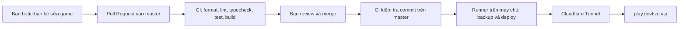

# Deploy game qua Cloudflare Tunnel và GitHub Actions

Địa chỉ dự kiến: **https://play.devtizo.vip**. Cấu hình trong repo đã chuẩn bị cho domain này; domain chỉ hoạt động sau khi máy chủ, Tunnel và hostname trên Cloudflare được thiết lập.

Cloudflare Tunnel nối máy chạy game với Cloudflare qua kết nối đi ra. Người chơi không cần IP của máy hay cổng 8787/2567. GitHub Actions thực hiện CI/CD: kiểm tra bản sửa, rồi triển khai bản đã merge vào `master`.



GitHub gọi yêu cầu merge là **Pull Request / PR**. **Merge Request / MR** là cách gọi trên GitLab.

## Chọn máy chạy server

| Máy              | Phù hợp             | Điều kiện                                                         |
| ---------------- | ------------------- | ----------------------------------------------------------------- |
| Windows hiện tại | Mở cho bạn bè thử   | Docker Desktop phải chạy, máy không sleep và mạng luôn có kết nối |
| VPS Linux        | Game hoạt động 24/7 | Cài Docker Engine, Compose plugin, Node.js 22 và Git              |

Cả hai dùng cùng Docker Compose và script Node.js. Các dịch vụ là web, API, realtime, PostgreSQL, Redis, LiteLLM, Caddy và cloudflared. Cloudflare không thay thế máy chạy các dịch vụ này.

## Thiết lập một lần

1. Trên máy chạy game, cài **Docker với Linux containers**, **Docker Compose >= 2.24.4**, **Node.js 22** và **Git**. Windows nên tắt sleep khi đang mở game.
2. Tạo thư mục riêng cho dữ liệu deploy, chẳng hạn `D:/CozyGameProduction` trên Windows hoặc `/srv/cozy-game` trên VPS. Thư mục này phải nằm ngoài và không bao chứa checkout Git hay thư mục GitHub runner.
3. Copy `infra/deploy/production.env.example` thành `.env` trong thư mục deploy. Đặt `GAME_DOMAIN=play.devtizo.vip`; điền email admin thật. Tạo **bốn giá trị khác nhau**, mỗi giá trị ít nhất 32 byte ngẫu nhiên cho `POSTGRES_PASSWORD`, `INTERNAL_SECRET`, `LITELLM_MASTER_KEY`, `LITELLM_SALT_KEY`. Password PostgreSQL dùng chuỗi hex để an toàn trong URL. Có thể tạo từng giá trị bằng `node -e "console.log(require('node:crypto').randomBytes(32).toString('hex'))"`.
4. Trong **Cloudflare Zero Trust → Networks → Connectors / Tunnels**, tạo một Tunnel kiểu **Cloudflared**, tên `cozy-game`. Lưu riêng token của Tunnel vào file trong thư mục deploy, ví dụ `tunnel-token.txt`. File chỉ chứa token, không chứa toàn bộ lệnh Docker mà dashboard đưa ra. Đặt quyền đọc riêng cho tài khoản chạy server; không commit hoặc gửi token lên PR.
5. Đặt `CLOUDFLARE_TUNNEL_TOKEN_FILE` trong `.env` thành đường dẫn tuyệt đối tới file đó. Windows dùng dấu `/`, ví dụ `D:/CozyGameProduction/tunnel-token.txt`.
6. Trong Tunnel, thêm **Published application route / Public hostname**: subdomain `play`, domain `devtizo.vip`, service type `HTTP`, URL **`caddy:80`**. `caddy` là tên service trong mạng Docker. Không nhập `localhost:8787` ở đây. Nếu hostname đã có DNS record, kiểm tra record đó trước khi thay thế. Không cần tạo Worker hay mở inbound port trên router để dùng Tunnel.
7. Clone repo vào một thư mục khác. Đặt `COZY_DEPLOY_DIR` và chạy script bên dưới từ một checkout đã commit và không có thay đổi chưa lưu.

Windows PowerShell:

```powershell
$env:COZY_DEPLOY_DIR = 'D:/CozyGameProduction'
node infra/deploy/deploy.mjs
```

VPS Linux:

```bash
COZY_DEPLOY_DIR=/srv/cozy-game node infra/deploy/deploy.mjs
```

Script build container theo SHA commit, khởi động hạ tầng, backup PostgreSQL trước khi API chạy migration, cập nhật dịch vụ rồi kiểm tra phiên bản web và readiness API/realtime **qua domain công khai**. Nếu deploy mới lỗi và đã có bản thành công trước đó, script thử phục hồi image và cấu hình của bản trước. Backup nằm trong `<deploy-dir>/backups`; `.env`, Tunnel token và các volume dữ liệu nằm riêng khỏi checkout.

`http://127.0.0.1:8082` là cổng kiểm tra trên máy chủ. Cổng này chỉ bind loopback. PostgreSQL, Redis, API, realtime và LiteLLM không publish cổng ra Internet trong cấu hình production.

## Tự cập nhật sau khi merge

1. Vào GitHub repo **Settings → Actions → Runners → New self-hosted runner**. Chọn hệ điều hành của máy chạy game, cài runner ở một thư mục khác thư mục deploy và checkout. Thêm label **`cozy-production`**, rồi cài runner chạy như service với tài khoản có quyền sử dụng Docker và đọc thư mục deploy.
2. Trong **Settings → Secrets and variables → Actions → Variables**, thêm:

| Variable          | Giá trị                                                            |
| ----------------- | ------------------------------------------------------------------ |
| `COZY_DEPLOY_DIR` | Đường dẫn tuyệt đối tới thư mục deploy trên máy chạy runner        |
| `AUTO_DEPLOY`     | `true`, chỉ bật sau khi lần deploy thủ công và domain đã hoạt động |

Không cần đưa token Tunnel hoặc master AI key vào GitHub Secrets: chúng nằm trên máy server.

3. Tạo ruleset cho `master`: yêu cầu PR, yêu cầu check **`quality-gate`**, và review trước khi merge. Bạn bè sửa trên nhánh riêng hoặc fork, gửi PR vào `master`.
4. Sau merge, GitHub chạy lại CI cho đúng commit. Nếu pass, job `deploy` chạy trên runner của bạn. Nếu máy server hoặc runner đang tắt, job chờ tới khi runner online.

PR chỉ chạy trên runner của GitHub, không chạy trên máy có database và token production. Job deploy chỉ chạy cho `push` vào `master` khi `AUTO_DEPLOY=true`. Các deploy được xếp hàng; commit cũ được bỏ qua nếu đã có commit mới hơn trên `master`.

Có thể tạm dừng tự deploy bằng cách đặt `AUTO_DEPLOY=false`. Nút **Run workflow** chạy lại CI; nó không triển khai production. Muốn triển khai thủ công, chạy script trên checkout của commit cần triển khai.

## Đường đi của request

| URL công khai        | Dịch vụ                                              |
| -------------------- | ---------------------------------------------------- |
| `/` và các asset web | Web container                                        |
| `/api/*`             | API, bỏ prefix `/api`                                |
| `/realtime/*`        | Matchmaking HTTP và WebSocket, bỏ prefix `/realtime` |
| `/v1/*`              | LiteLLM cho các virtual key của người chơi           |
| `/version.txt`       | SHA của web đã deploy                                |

Web production được build với `VITE_API_URL=/api` và `VITE_REALTIME_URL=/realtime`. Người chơi chỉ dùng HTTPS/WSS trên domain, không kết nối cổng dev. Endpoint `/internal/*` và metrics bị chặn ở proxy công khai. Cloudflare không nên cache API, matchmaking hoặc `version.txt`, và không nên chèn trang challenge vào API/WebSocket; asset có hash được cache lâu, HTML yêu cầu kiểm tra lại khi tải.

## Dữ liệu và vận hành

- Coin, tài khoản, nội thất và kho đồ nằm trong PostgreSQL volume; deploy không chạy `down -v` hay xóa volume. Redis cũng có volume riêng. Giữ cùng project name `cozy-compute-prod` khi quản lý production.
- Trước mỗi deploy có snapshot database game. Nên lập lịch backup hàng ngày, thêm backup database `litellm` và lưu một bản ngoài máy chạy game. Các script mẫu ở `infra/backup`; trên Windows cần chương trình `gzip` nếu dùng script PowerShell cũ, trong khi backup của script deploy dùng gzip tích hợp của Node.
- Deploy này cập nhật container; khi API/realtime restart, người đang chơi có thể mất kết nối trong thời gian ngắn rồi kết nối lại. Người đã mở trang cần tải lại để nhận frontend mới. Đây chưa phải mô hình cập nhật không gián đoạn.
- Rollback image không đảo ngược migration database. Migration nên tương thích với phiên bản trước. Nếu thay đổi schema không tương thích, dùng backup và một kế hoạch phục hồi đã kiểm tra.
- Không đổi `LITELLM_SALT_KEY` sau khi có dữ liệu gateway. Provider credentials chỉ đặt trên server và cấu hình LiteLLM.
- Nếu domain báo lỗi Tunnel, kiểm tra connector trên Cloudflare và logs service `cloudflared`; nếu chỉ đăng nhập hoặc vào phòng lỗi, kiểm tra `/api/readyz` và `/realtime/readyz`.
