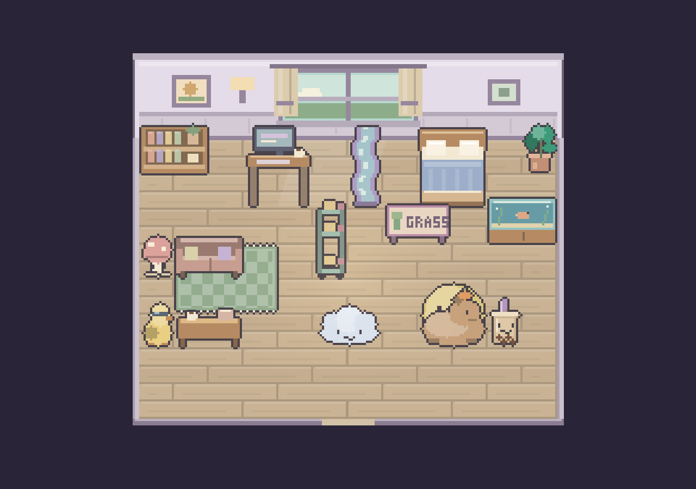
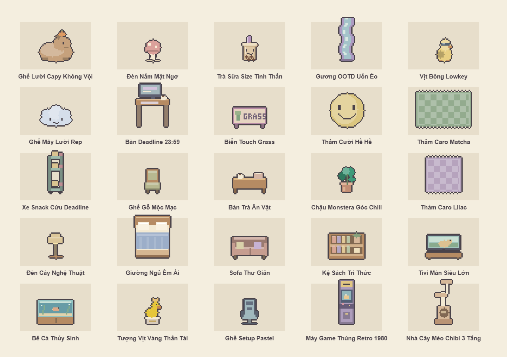

# Căn hộ “Góc chill”

Thiết kế phòng và 25 món nội thất bằng pixel art vẽ trong mã nguồn. Bộ mới gồm 11 món có hình dáng vui, tên và mô tả theo tinh thần Gen Z; toàn bộ đi qua cửa hàng, kho đồ và API lưu căn hộ thật.

## Tham khảo và hướng thiết kế

- [Unpacking — trang chính thức](https://unpackinggame.com/): tham khảo cách tạo cảm giác ấm áp bằng gỗ, vật dụng đời thường, hình dáng đồ dễ nhận biết và các góc sinh hoạt trong một phòng. Đã xem hình minh họa phòng trên trang chính thức; không đưa hình hay tài sản của Unpacking vào game.
- Đồ trang trí lấy cảm hứng từ những hình ảnh quen thuộc: capybara đội quýt, trà sữa, nấm pastel, gương lượn sóng, thảm caro, “touch grass” và góc làm việc chạy deadline. Tên vui nhưng mô tả rõ đây là nội thất trang trí.
- Giữ phong cách pixel của thị trấn, viền nâu tím mềm và bảng màu gỗ, kem, lilac, matcha. Không dùng hình AI hay ảnh tham khảo làm texture.

## Phòng mới

Tường cắt lớp cao hơn, cửa sổ lớn có rèm, chân tường, tranh nhỏ và sàn gỗ dài lệch mạch. Ánh sáng dịu để đồ không bị bạc màu. Thêm **Lilac Soft Life** và **Matcha Chạm Cỏ**; cả bốn chủ đề cũ vẫn sử dụng được.

Lưới đặt đồ vẫn là 12×9, hàng đầu dành cho tường. Tọa độ đồ trong phòng đã lưu giữ nguyên. Khung nhìn cố định bao trọn phòng; khi trang trí, camera dùng chiều cao thanh công cụ thực tế để đưa phòng lên phía trên.

Ảnh trên là bố trí minh họa dùng chính `ApartmentScene` và catalogue của game, không phải đồ tặng sẵn cho người chơi.

## 11 món mới

| Món                     | Ô   | Coin | Chi tiết                            |
| ----------------------- | --- | ---: | ----------------------------------- |
| Ghế Lười Capy Không Vội | 2×2 |  520 | Capy đội quýt, dáng ghế lười        |
| Đèn Nấm Mặt Ngơ         | 1×1 |  140 | Nấm hồng với mặt nhỏ                |
| Trà Sữa Size Tinh Thần  | 1×1 |  120 | Ly lớn có trân châu và ống hút      |
| Gương OOTD Uốn Éo       | 1×2 |  380 | Viền lilac lượn sóng                |
| Vịt Bông Lowkey         | 1×1 |   95 | Vịt vàng đeo kính                   |
| Ghế Mây Lười Rep        | 2×1 |  340 | Mây xanh nhạt có mặt cười           |
| Bàn Deadline 23:59      | 2×2 |  680 | Màn hình, bàn phím, cà phê          |
| Biển Touch Grass        | 2×1 |  180 | Biển tự đứng, hình cây và chữ GRASS |
| Thảm Cười Hề Hề         | 2×2 |  190 | Thảm tròn mặt cười                  |
| Thảm Caro Matcha        | 3×2 |  320 | Caro xanh và kem                    |
| Xe Snack Cứu Deadline   | 1×2 |  360 | Xe ba tầng bánh và nước mô hình     |

Giá trên là giá seed ban đầu. Giá quản trị đã chỉnh trong cơ sở dữ liệu vẫn được giữ. ID, kích thước và giá của 14 món cũ không thay đổi.

## Sử dụng

Trong **Sofa So Good**, chọn **Góc Gen Z**, mua đồ rồi về căn hộ, bấm **Trang trí**. Kho có ảnh, tên và số lượng còn lại. Chọn món rồi bấm sàn để đặt; bấm món đã đặt để thu lại. Thảm nằm dưới nội thất; khi chọn một ô có cả thảm và ghế, ghế được chọn trước.

Bàn phím: mũi tên chọn ô, **E** đặt hoặc thu lại, **R** xoay, **Delete** cất đồ tại ô, **Esc** bỏ chọn. **Ctrl/Cmd+Z** hoàn tác, **Ctrl/Cmd+Shift+Z** làm lại. Nhập tên và chọn chủ đề không bị phím tắt trang trí can thiệp.

Khách ghé thăm tải đúng chủ đề và nội thất đã lưu, có thể mở lưu bút và nhận bố cục mới khi chủ phòng lưu.

## Cập nhật và kiểm chứng

- Chạy `pnpm migrate` hoặc khởi động lại API để seed 11 món mới và cập nhật hình, tên của món cũ. Không cần migration thay đổi schema.
- API kiểm tra quyền sở hữu, số lượng, vị trí, xoay và chồng đồ; giá mua và điểm phòng được tính trên server.
- `apps/api/test/apartment-decor.test.ts`: mua từng món với giá server và khóa idempotency; lưu các chủ đề mới, thảm dưới ghế, xoay và đọc phòng bằng tài khoản khách; từ chối đồ chưa mua, quá số lượng, chồng đồ và khai sai kích thước.
- `apps/web/e2e/apartment-render.spec.ts`: render 6 chủ đề và 25 món ở 4 góc xoay, restart scene, chế độ giảm chuyển động; thao tác editor thực bằng bàn phím và lưu; khung nhìn trên 1280×720, 1440×900, 1920×1080; tải và refresh phòng khách. HTTP trong fixture trình duyệt được chặn bằng dữ liệu kiểm thử; kinh tế được kiểm tra riêng bằng API thật với PostgreSQL và Redis riêng.
