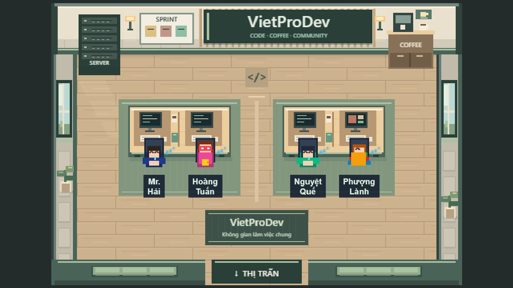
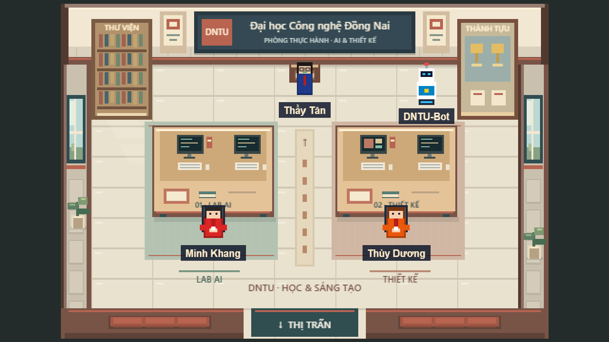

# VietProDev và phòng thực hành DNTU

Hai phòng dùng pixel art vẽ bằng Canvas trong mã nguồn, cùng phong cách với thị trấn và căn hộ. Texture nền được tạo một lần rồi dùng lại khi chuyển cảnh; không tải thêm thư viện hay ảnh bên ngoài.

## VietProDev

Studio lập trình với sàn gỗ sồi, tường kem, xanh sage và hai cụm bàn làm việc. Tường sau có lam gỗ, biển VietProDev, bảng sprint, tủ server và quầy cà phê. Cửa sổ, đèn tường, cây xanh, bàn phím, cốc cà phê và sách tạo cảm giác một nơi làm việc có người sử dụng. Nhân viên giữ tên, vai trò và lời thoại hiện có.



## Đại học Công nghệ Đồng Nai

Phòng thực hành dùng sàn gạch kem, gỗ sáng và điểm nhấn đỏ đất. Khu Lab AI có thảm xanh, khu thiết kế có thảm màu đất; lối giữa có chỉ dẫn hướng lên màn hình giảng dạy. Hai bên là thư viện và tủ thành tựu. Thầy Tân, sinh viên và DNTU-Bot vẫn có lời thoại và tương tác.



## Di chuyển và tương tác

Kích thước phòng giữ 16×11 ô. Nền bàn dùng `COMPANY_DESKS` và `DNTU_DESKS` trong game-data, cùng hình học với va chạm phía server. Lối giữa nối điểm xuất hiện với khu giảng dạy và cửa ra. Các băng ghế phía trước được vẽ trong phần tường vốn đã chặn di chuyển; thảm và chỉ dẫn sàn không tạo chướng ngại vật.

Dùng WASD hoặc mũi tên để đi, E để tương tác gần nhất, Esc để đóng hội thoại. Có thể bấm trực tiếp vào nhân vật, bảng sprint, cà phê, tủ server, màn hình, thư viện và tủ thành tựu. Nhãn gợi ý E hiện khi đến gần; xuống cửa phía dưới để về thị trấn. Tắt chuyển động theo cài đặt giảm chuyển động.

Camera dùng mức phóng nguyên và hiển thị trọn phòng ở các màn hình đã kiểm thử: 800×600, 1280×720, 1440×900 và 1920×1080.

## Xem và kiểm tra

Chạy Vite rồi mở `/e2e/fixtures/interiors.html` để xem cảnh thật trong trình duyệt. Fixture này chỉ kiểm tra hiển thị và tương tác cục bộ, không kết nối multiplayer.

Thêm `?room=university` vào URL để mở thẳng trường DNTU.

```powershell
pnpm --filter @cozy/web dev
pnpm --filter @cozy/web exec playwright test e2e/interior-render.spec.ts
$env:E2E_SHOTS_DIR = 'D:/Game_Cua_Bao/docs/design'
node apps/web/e2e/interior-preview.mjs
```

Kiểm tra đường đi và va chạm trong `packages/game-data/src/interior-layout.test.ts`; kiểm tra nhãn, hội thoại, bàn phím, bấm chuột, giảm chuyển động, restart và cửa ra trong `apps/web/e2e/interior-render.spec.ts`. Khi triển khai cả các thay đổi hình học bàn có sẵn trong checkout, cần cập nhật web và realtime cùng phiên bản.
