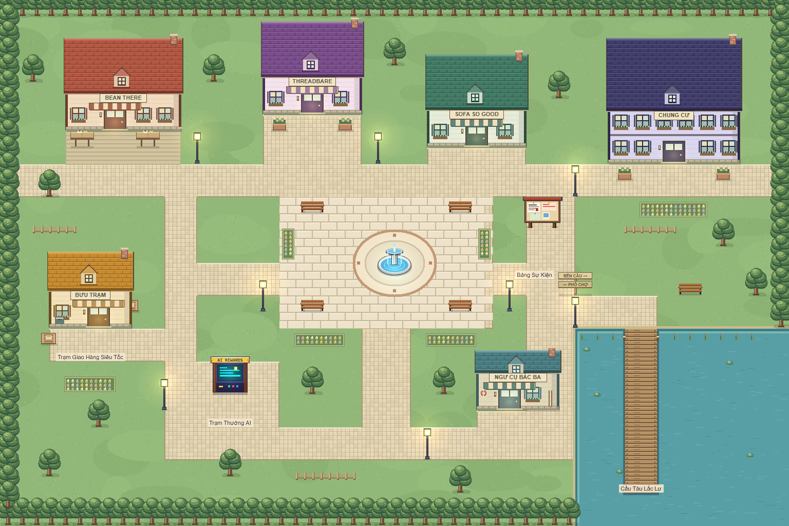

# Thiết kế lại thị trấn Cozy Compute

Hướng thiết kế: một thị trấn nhỏ ven hồ, có quảng trường làm điểm tụ họp, các cửa hàng dễ nhận diện và đường đi liên tục. Giữ góc nhìn 2D từ trên xuống, pixel art rõ nét và màu ấm, dịu để nhân vật, hội thoại và điểm tương tác nổi bật.



[Xem ảnh trước khi thiết kế lại để đối chiếu](town-before.png).

## Nghiên cứu mẫu phù hợp

| Nguồn                                                                                                                                                        | Quan sát từ mẫu                                                                                        | Áp dụng trong game                                                                                                     |
| ------------------------------------------------------------------------------------------------------------------------------------------------------------ | ------------------------------------------------------------------------------------------------------ | ---------------------------------------------------------------------------------------------------------------------- |
| [Kenney — Tiny Town](https://kenney.nl/assets/tiny-town)                                                                                                     | Mái nhà chiếm phần lớn hình khối; cửa, cửa sổ và cây có silhouette dễ đọc; đường nối từng cụm nhà.     | Tăng diện tích mái, thu gọn mặt tiền, thêm mái cửa sổ, cửa chớp và mái hiên; chia cửa hàng theo màu và đặc điểm riêng. |
| [Stardew Valley — ảnh chính thức](https://www.stardewvalley.net/wp-content/uploads/2018/12/StardewValley_4.png) và [website](https://www.stardewvalley.net/) | Cây, hàng rào và nền đường phân chia không gian; chi tiết tập trung ở công trình và các cụm cảnh quan. | Giảm nhiễu nền cỏ, thêm cụm cây, bồn hoa, hàng rào ngắn và sân quán cà phê; dành khoảng trống cho hoạt động xã hội.    |
| [Design system của dự án](../../ai_social_mmo_claude_opus_plan/ai_social_mmo_plan/design/06_UI_UX_DESIGN_SYSTEM.md)                                          | Thế giới pixel kết hợp UI dễ đọc; hạn chế hạt hiệu ứng; khu ở và sự kiện là điểm đến xã hội.           | Giữ UI hiện có, dùng nhãn dễ đọc, giảm ánh sáng và số hạt; làm rõ khu dân cư, bảng sự kiện và lối đến bến câu.         |

Đã mở trang nguồn và xem hai ảnh mẫu của Kenney và Stardew Valley. Artwork trong game được vẽ bằng Canvas của dự án, không dùng sprite, nhân vật hay nền của các game tham khảo. Kenney Tiny Town có giấy phép CC0, nhưng bản thay đổi này cũng không nhập asset từ bộ đó.

## Bố cục mới

- **Phố cửa hàng phía Bắc:** cà phê, thời trang, nội thất và chung cư đặt so le; mặt tiền hướng về đường chính. Sân quán có bàn; cửa hàng thời trang và chung cư có chậu hoa.
- **Quảng trường giữa thị trấn:** đài phun nằm trong vòng đá trang trí; bốn ghế ở các góc; hai bồn hoa ở cạnh. Có đường nối phía Bắc, Nam, Đông và Tây.
- **Bưu trạm phía Tây:** cửa chính mở ra sân giao nhận và đường nối ngang, tránh phải đứng bên hông công trình để tương tác.
- **Trạm AI phía Tây Nam:** nối với đường vòng và quảng trường, giữ vị trí và chức năng hiện có.
- **Khu câu cá phía Đông Nam:** tiệm ngư cụ mở ra đường ven hồ; biển chỉ hướng đặt ở ngã rẽ; lối tiếp cận bến câu chạy dọc bờ phía Bắc của hồ.
- **Đường vòng:** nối các khu thành một mạng đường đi, giúp khám phá và giao hàng mà không phải đoán lối qua bãi cỏ.

## Đồ họa

| Thành phần   | Quyết định                                                                                             |
| ------------ | ------------------------------------------------------------------------------------------------------ |
| Nền cỏ       | Xanh sage `#92b879`, các mảng màu lớn và điểm cỏ thưa.                                                 |
| Đường đi     | Đá kem `#e6d8b7`, cạnh lát rõ; vẽ hợp các đoạn đường để ngã rẽ không có đường viền cắt ngang.          |
| Công trình   | Mái ngói xếp lớp, dormer, ống khói, mặt tiền gọn, cửa kính, chậu hoa; mái hiên theo màu từng cửa hàng. |
| Quảng trường | Đá limestone sáng, vòng trang trí terracotta, ghế và hoa đặt ngoài vùng tập trung.                     |
| Cây          | Tán cây vẽ theo từng hàng pixel; màu lá có bốn mức sáng tối; bóng tiếp đất nhỏ.                        |
| Hồ           | Xanh teal `#589fa5`, mép nước, lau sậy, lá súng và gợn nước tiết chế.                                  |
| Hiệu ứng     | Giảm độ sáng đèn và số hạt từ 22 xuống 12; giữ hỗ trợ reduced motion.                                  |
| Camera       | Zoom theo số nguyên, giữ nearest-neighbor và round pixels.                                             |

## Tính nhất quán và kiểm chứng

Vị trí nhà, vùng tương tác, vật cản, cây và đạo cụ được khai báo trong `packages/game-data/src/map.ts`. Client dùng cùng dữ liệu để vẽ và dự đoán chuyển động; server tiếp tục quyết định vị trí hợp lệ. Kích thước bản đồ, vị trí xuất hiện, tốc độ và cơ chế kinh tế giữ nguyên.

Test bản đồ dùng bộ giải chuyển động thực tế, bao gồm vùng va chạm bàn chân, để kiểm tra:

1. Tất cả vùng hoạt động có đường lát hoặc bến gỗ nối từ điểm xuất hiện.
2. Cửa mỗi công trình nằm ngay trước vùng tương tác đúng và có thể tiếp cận.
3. Tất cả vị trí vịt sự kiện đi tới được và không nằm trong vật cản.

Test trình duyệt dựng `TownScene` thật tại 1280×720, 1440×900 và 1920×1080, kiểm tra texture, resize, khởi động lại scene và reduced motion. Fixture này chỉ kiểm tra hiển thị, không kết nối phòng multiplayer hoặc xác minh các giao dịch. Chạy khi Vite đang mở:

```powershell
pnpm --filter @cozy/web exec playwright test town-render.spec.ts
```

Mở `/e2e/fixtures/town.html` trên Vite để xem scene riêng phục vụ kiểm tra đồ họa. Khi đưa vào game đang chạy, cần khởi động lại API/realtime để cả client và server cùng dùng bản đồ mới.
